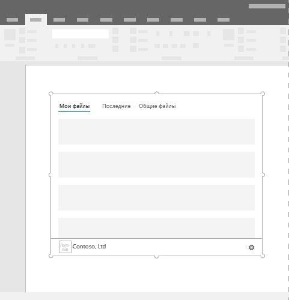

# Контентные надстройки OfficeContent Office Add-ins

Контентные надстройки — это рабочие области, которые можно внедрять прямо в документы Word, Excel и PowerPoint. Контентные надстройки предоставляют пользователям доступ к элементам управления интерфейсом, которые выполняют код для изменения документов или отображения данных. Используйте контентные надстройки, когда нужно внедрить функции прямо в документ.Content add-ins are surfaces that can be embedded directly into Word, Excel, or PowerPoint documents. Content add-ins give users access to interface controls that run code to modify documents or display data from a data source. Use content add-ins when you want to embed functionality directly into the document.  

*Рисунок 1. Макет для контентных надстроек**Figure 1. Typical layout for content add-ins*

## РекомендацииBest practices

- Включите элемент навигации или управления, такой как CommandBar или Pivot, в верхнюю часть надстройки.Include some navigational or commanding element such as the CommandBar or Pivot at the top of your add-in.
- Включите элемент фирменной символики, такой как BrandBar, в нижнюю часть надстройки (применимо только к надстройкам Word, Excel и PowerPoint).Include a branding element such as the BrandBar at the bottom of your add-in (applies to Word, Excel, and PowerPoint add-ins only).

## ВариантыVariants

Размеры контентных надстроек для Word, Excel и PowerPoint в Office 2016 для настольных систем и Office 365 указывает пользователь.Content add-in sizes for Word, Excel, and PowerPoint in Office 2016 desktop and Office 365 are user specified.

## Меню личных данныхPersonality menu

Меню личных данных могут перекрывать элементы навигации и управления, расположенные в правой верхней части надстройки. Ниже указаны текущие размеры меню личных данных в Windows и Mac.Personality menus can obstruct navigational and commanding elements located near the top right of the add-in. The following are the current dimensions of the personality menu on Windows and Mac.

В Windows меню личных данных имеет размер 12 x 32 пикселей, как показано на изображении.For Windows, the personality menu measures 12x32 pixels, as shown.

*Рисунок 2. Меню личных данных в Windows**Figure 2. Personality menu on Windows* 

В Mac меню личных данных имеет размер 26 x 26 точек, но сдвинуто на 8 пикселей влево и на 6 вниз, из-за чего оно занимает пространство размером 34 x 32 пикселей, как показано на изображении.For Mac, the personality menu measures 26x26 pixels, but floats 8 pixels in from the right and 6 pixels from the top, which increases the occupied space to 34x32 pixels, as shown.

*Рисунок 3. Меню личных данных на Mac**Figure 3. Personality menu on Mac*

## РеализацияImplementation

Пример реализации контентной надстройки для Excel: [Humongous Insurance](https://github.com/OfficeDev/Excel-Content-Add-in-Humongous-Insurance) на сайте GitHub.For a sample that implements a content add-in, see [Excel Content Add-in Humongous Insurance](https://github.com/OfficeDev/Excel-Content-Add-in-Humongous-Insurance) in GitHub.

## Что касается поддержкиSupport considerations
- Проверьте, будет ли ваша надстройка Office работать на [конкретной платформе Office](https://docs.microsoft.com/en-us/office/dev/add-ins/overview/office-add-in-availability).Check to see if your Office Add-in will work on a [specific Office host platform](https://docs.microsoft.com/en-us/office/dev/add-ins/overview/office-add-in-availability). 
- Чтобы надстройка могла читать и записывать данные в Excel или PowerPoint, может потребоваться добавление в список доверия сертификатов.Some content add-ins may require the user to "trust" the add-in to read and write to Excel or PowerPoint. Вы можете объявить нужный [уровень разрешений](https://docs.microsoft.com/en-us/office/dev/add-ins/develop/requesting-permissions-for-api-use-in-content-and-task-pane-add-ins) в манифесте надстройки.You can declare what [level of permissions](https://docs.microsoft.com/en-us/office/dev/add-ins/develop/requesting-permissions-for-api-use-in-content-and-task-pane-add-ins) you want your use to have in the add-in's manifest.  
- Надстройки контента поддерживаются в Excel и PowerPoint в Office 2013 и более поздних версиях.Content add-ins are supported in Excel and PowerPoint in Office 2013 version and later. Если вы откроете надстройку в версии Office, которая не поддерживает веб-надстройки, вместо надстройки будет показано изображение.If you open an add-in in a version of Office that doesn't support Office web add-ins, the add-in will be displayed as an image.

## См. такжеSee also
- [Сведения о доступности элементов для надстроек Office, представленные с учетом ведущих приложений и платформOffice Add-in host and platform availability](https://docs.microsoft.com/en-us/office/dev/add-ins/overview/office-add-in-availability)
- [Office UI Fabric в надстройках OfficeOffice UI Fabric in Office Add-ins](https://docs.microsoft.com/en-us/office/dev/add-ins/design/office-ui-fabric) 
- [Шаблоны проектирования взаимодействия для надстроек OfficeUX design patterns for Office Add-ins](https://docs.microsoft.com/en-us/office/dev/add-ins/design/ux-design-patterns)
- [Запрашивание разрешений на использование API в контентных надстройках и надстройках области задачRequesting permissions for API use in content and task pane add-ins](https://docs.microsoft.com/en-us/office/dev/add-ins/develop/requesting-permissions-for-api-use-in-content-and-task-pane-add-ins)
