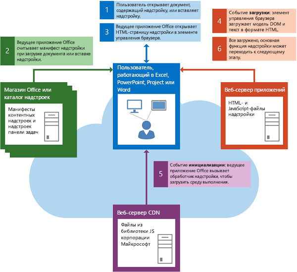
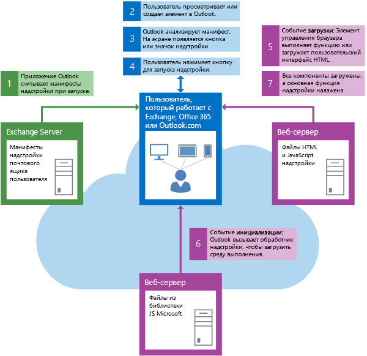

# <a name="loading-the-dom-and-runtime-environment"></a>Загрузка модели DOM и среды выполнения


Перед запуском собственной логики надстройка должна проверить, что загружены модель DOM и среда выполнения Надстройки Office. 

## <a name="startup-of-a-content-or-task-pane-add-in"></a>Запуск контентной надстройки или надстройки области задач

На рисунке ниже приведен поток событий, происходящих при запуске контентной надстройки или надстройки области задач в Excel, PowerPoint, Project, Word или Access.



При запуске контентной надстройки или надстройки области задач возникают указанные ниже события. 


1. Пользователь открывает документ, который уже содержит надстройку, или вставляет надстройку в документ.
    
2. Ведущее приложение Office читает XML-манифест надстройки из AppSource, каталога надстроек в SharePoint или каталога общей папки, в зависимости от того, откуда берется надстройка.
    
3. Ведущее приложение Office открывает HTML-страницу надстройки в элементе управления браузера.
    
    Следующие два действия, 4 и 5, выполняются одновременно и параллельно. Поэтому код надстройки перед обработкой должен убедиться, что и модель DOM, и среда выполнения надстройки полностью загрузились.
    
4. Элемент управления браузера загружает модель DOM и основной текст HTML, а также вызывает обработчик для события  **window.onload**.
    
5. Ведущее приложение Office загружает среду выполнения, которая загружает и кэширует API JavaScript для файлов библиотеки JavaScript с сервера сети доставки содержимого, а затем вызывает обработчик события [инициализации](https://dev.office.com/reference/add-ins/shared/office.initialize) объекта [Office](https://dev.office.com/reference/add-ins/shared/office).
    
6. После завершения загрузки DOM и основного текста HTML и инициализации надстройки запускается основная функция надстройки.
    

## <a name="startup-of-an-outlook-add-in"></a>Запуск надстройки Outlook


На рисунке ниже приведен поток событий при запуске надстройки Outlook на настольном компьютере, планшетном ПК или смартфоне.



При запуске надстройки Outlook происходят указанные ниже события. 


1. При запуске Outlook считывает XML-манифесты надстроек Outlook, установленных для учетной записи пользователя.
    
2. Пользователь выбирает элемент в Outlook.
    
3. Если выбранный элемент удовлетворяет условиям активации надстройки Outlook, то Outlook активирует надстройку и делает соответствующую кнопку видимой в пользовательском интерфейсе.
    
4. Если пользователь нажимает кнопку для запуска надстройки Outlook, то ведущее приложение открывает HTML-страницу в элементе управления браузером. Следующие два шага, шаг 5 и шаг 6, выполняются одновременно.
    
5. Элемент управления браузером загружает DOM и основной текст HTML и вызывает обработчик события  **onload**.
    
6. Outlook вызывает обработчик события [initialize](https://dev.office.com/reference/add-ins/shared/office.initialize) объекта [Office](https://dev.office.com/reference/add-ins/shared/office) надстройки.
    
7. После завершения загрузки DOM и основного текста HTML и инициализации надстройки запускается основная функция надстройки.
    

## <a name="checking-the-load-status"></a>Проверка состояния загрузки


Один из способов проверки завершения загрузки DOM и среды выполнения надстроек для — это возможность использования функции [.ready()](http://api.jquery.com/ready/) jQuery — `$(document).ready()`. Например, следующая функция обработчика событий  **initialize** убеждается в полной загрузке DOM, прежде чем выполняется код, относящийся к инициализации надстроек. После этого обработчик события **initialize**переходит на использование текущего выбранного элемента в Outlook, а обработчик событий переходит на использование свойства [mailbox.item](https://dev.office.com/reference/add-ins/outlook/Office.context.mailbox.item) для получения выбранного в настоящий момент элемента Outlook и вызывает основную функцию надстройки `initDialer`.


```js
Office.initialize = function () {
    // Checks for the DOM to load.
    $(document).ready(function () {
        // After the DOM is loaded, add-in-specific code can run.
        var mailbox = Office.context.mailbox;
        _Item = mailbox.item;
        initDialer();
    });
}
```

Эта же техника может использоваться в обработчике событий  **initialize** любого приложения Надстройка Office.

В примере надстройки Outlook "Телефон" показан несколько другой подход, использующий только JavaScript для проверки тех же условий. 

> [!IMPORTANT]
> Даже если у надстройки нет задач инициализации, необходимо включить по крайней мере минимальную функцию обработчика событий **Office.initialize**, как в примере ниже.

```js
Office.initialize = function () {
};
```

Если вы не включите обработчик событий  **Office.initialize**, надстройка может выдать ошибку при запуске. Кроме того, если пользователь попытается применить надстройку с веб-клиентом Office Online, например Excel Online, PowerPoint Online или Outlook Web App, она не будет работать.

Если надстройка содержит несколько страниц, каждая загружаемая страница должна содержать обработчик событий  **Office.initialize** или вызывать его.


## <a name="see-also"></a>См. также

- [Общие сведения об интерфейсе API JavaScript для Office](understanding-the-javascript-api-for-office.md)
    
