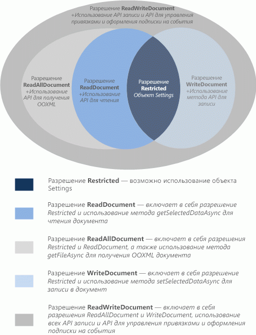

# <a name="requesting-permissions-for-api-use-in-content-and-task-pane-add-ins"></a>Запрос разрешений на использование API в контентных надстройках и надстройках области задач

В этой статье описываются различные уровни разрешений, которые можно объявить в манифесте контентной надстройки или надстройки области задач, чтобы указать уровень доступа JavaScript API, необходимый вашей надстройке. 


## <a name="permissions-model"></a>Модель разрешений


5-уровневая модель разрешений JavaScript API — это основа безопасности и конфиденциальности для пользователей контентных надстроек и надстроек области задач. На рис. 1 показаны пять уровней разрешений API, которые можно объявить в манифесте надстройки.


*Рис. 1. Пятиуровневая модель разрешений для контентных надстроек и надстроек области задач*




Эти разрешения задают подмножество API, которые контентная надстройки или надстройка области задач сможет использовать во время выполнения, когда пользователь вставляет, а затем активирует ваше приложение (доверяет ему). Чтобы объявить уровень разрешений, необходимый вашей надстройке, укажите одно из текстовых значений разрешения в элементе [Permissions](http://msdn.microsoft.com/ru-ru/library/d4cfe645-353d-8240-8495-f76fb36602fe%28Office.15%29.aspx) манифеста надстройки. Следующий пример запрашивает разрешение **WriteDocument**, который разрешает использовать только методы записи в документ (но не методы чтения).


```XML
<Permissions>WriteDocument</Permissions>
```

Рекомендуется запрашивать разрешения по принципу  _минимальной привилегии_. Т. е. следует запрашивать разрешения для доступа только к минимальному подмножеству API, необходимому надстройке для правильной работы. Например, если надстройке требуется только читать данные документа пользователя, оно должно запрашивать максимум разрешение **ReadDocument**.

В следующей таблице описывается подмножество API JavaScript, предоставляемое каждым уровнем разрешений.


|**Разрешение**|**Включенное подмножество API**|
|:-----|:-----|
|**Существуют ограничения**|Методы объекта [Settings](https://dev.office.com/reference/add-ins/shared/settings) и метод [Document.getActiveViewAsync](https://dev.office.com/reference/add-ins/shared/document.getactiveviewasync).Это минимальный уровень разрешений, запрашиваемый контентной надстройкой или надстройкой области задач.|
|**ReadDocument**|В дополнение к интерфейсам API, предоставляемым разрешением  **Restricted**, добавляет доступ к элементам API, необходимым для чтения документа и управления привязками.В том числе разрешается использование следующих элементов:<br/><ul><li>Метод <a href="https://dev.office.com/reference/add-ins/shared/document.getselecteddataasync" target="_blank">Document.getSelectedDataAsync</a> для получения выбранного текста, HTML (только Word) или табличных данных, но не базовый код Open Office XML (OOXML), содержащий все данные в документе.</p></li><li><p>Метод <a href="https://dev.office.com/reference/add-ins/shared/document.getfileasync" target="_blank">Document.getFileAsync</a> для получения всего текста документа, но не двоичной копии OOXML документа.</p></li><li><p>Метод <a href="http://msdn.microsoft.com/ru-ru/library/5372ffd8-579d-4fcb-9e5b-e9a2128f3201(Office.15).aspx" target="_blank">Binding.getDataAsync</a> для чтения связанных данных в документе.</p></li><li><p>Методы <a href="http://msdn.microsoft.com/ru-ru/library/afbadac7-60c7-47cb-9477-6e9466ded44c(Office.15).aspx" target="_blank">addFromNamedItemAsync</a>, <a href="http://msdn.microsoft.com/ru-ru/library/9dc03608-b08b-4700-8be1-3c86ae236799(Office.15).aspx" target="_blank">addFromPromptAsync</a>, <a href="http://msdn.microsoft.com/ru-ru/library/edc99214-e63e-43f2-9392-97ead42fc155(Office.15).aspx" target="_blank">addFromSelectionAsync</a> объекта <span class="keyword">Bindings</span> для создания привязок в документе.</p></li><li><p>Методы <a href="http://msdn.microsoft.com/ru-ru/library/ef902b73-cc4c-4551-95de-d8a51eeba82f(Office.15).aspx" target="_blank">getAllAsync</a>, <a href="http://msdn.microsoft.com/ru-ru/library/2727c891-bc05-465c-9324-113fbfeb3fbb(Office.15).aspx" target="_blank">getByIdAsync</a> и <a href="http://msdn.microsoft.com/ru-ru/library/ad285984-8b44-435d-9b84-f0ade570c896(Office.15).aspx" target="_blank">releaseByIdAsync</a> объекта <span class="keyword">Bindings</span> для доступа к привязкам документа и их удаления.</p></li><li><p>Метод <a href="http://msdn.microsoft.com/ru-ru/library/2533a563-95ae-4d52-b2d5-a6783e4ef5b4(Office.15).aspx" target="_blank">Document.getFilePropertiesAsync</a> для доступа к свойствам файла документа, таким как URL-адрес документа.</p></li><li><p>Метод <a href="http://msdn.microsoft.com/ru-ru/library/35dda81c-235e-4eab-8a77-9acb3b73a380(Office.15).aspx" target="_blank">Document.goToByIdAsync</a> для перехода к именованным объектам и расположениям в документе.</p></li><li><p>Для надстроек области задач для Project — все методы "get" объекта <a href="http://msdn.microsoft.com/ru-ru/library/1908af4f-93b9-4859-87e3-06942014fae1(Office.15).aspx" target="_blank">ProjectDocument</a>. </p></li></ul>|
|**ReadAllDocument**|В дополнение к интерфейсам API, предоставляемым разрешениями **Restricted** и **ReadDocument**, дает следующие дополнительные права доступа к данным документа:<br/><ul><li><p>Методы <span class="keyword">Document.getSelectedDataAsync</span> и <span class="keyword">Document.getFileAsync</span> получают доступ к коду OOXML документа (который кроме текста может содержать форматирование, ссылки, встроенную графику, комментарии, редакции и т. д.).</p></li></ul>|
|**WriteDocument**|В дополнение к интерфейсам API, предоставляемым разрешением **Restricted**, добавляет доступ к следующим элементам API:<br/><ul><li><p>Метод <a href="http://msdn.microsoft.com/ru-ru/library/998f38dc-83bd-4659-a759-4758c632a6ef(Office.15).aspx" target="_blank">Document.setSelectedDataAsync</a> для записи данных в выделенную пользователем область документа.</p></li></ul>|
|**ReadWriteDocument**|В дополнение к интерфейсам API, предоставляемым разрешениям  **Restricted**,  **ReadDocument**,  **ReadAllDocument** и **WriteDocument**, дает доступ ко всем оставшимся API, поддерживаемым контентными надстройками и надстройками области задач, в том числе методам для подписки на событий.Для доступа к этим дополнительные элементам API-интерфейса необходимо объявить разрешение  **ReadWriteDocument**:<br/><ul><li><p>Метод <a href="http://msdn.microsoft.com/ru-ru/library/6a59bb6d-40b6-4a95-9b98-d70d4616de09(Office.15).aspx" target="_blank">Binding.setDataAsync</a> для записи в связанных областях документа.</p></li><li><p>Метод <a href="http://msdn.microsoft.com/ru-ru/library/1cd23454-8435-4e13-98b3-d0d29ed278a8(Office.15).aspx" target="_blank">TableBinding.addRowsAsync</a> для добавления строк в связанные таблицы.</p></li><li><p>Метод <a href="http://msdn.microsoft.com/ru-ru/library/8f1bfa81-3850-4ea1-ba2e-c9bcf5847a44(Office.15).aspx" target="_blank">TableBinding.addColumnsAsync</a> для добавления столбцов в связанные таблицы.</p></li><li><p>Метод <a href="http://msdn.microsoft.com/ru-ru/library/8f5cc783-384d-4520-a218-190dfed74dd2(Office.15).aspx" target="_blank">TableBinding.deleteAllDataValuesAsync</a> для удаления всех данных в связанной таблице.</p></li><li><p>Методы <a href="http://msdn.microsoft.com/ru-ru/library/49712906-f582-4055-9ef8-6edde6e97679(Office.15).aspx" target="_blank">setFormatsAsync</a>, <a href="http://msdn.microsoft.com/ru-ru/library/cc56e9c0-b33c-4d9b-b676-a7e50f757c10(Office.15).aspx" target="_blank">clearFormatsAsync</a> и <a href="http://msdn.microsoft.com/ru-ru/library/2885fc57-4527-4ca4-a43d-9ee447ec27d3(Office.15).aspx" target="_blank">setTableOptionsAsync</a> объекта <span class="keyword">TableBinding</span> для настройки форматирования и параметров связанных таблиц.</p></li><li><p>Все элементы объектов <a href="http://msdn.microsoft.com/ru-ru/library/dc1518de-47fa-4108-aab7-04a022724b04(Office.15).aspx" target="_blank">CustomXmlNode</a>, <a href="http://msdn.microsoft.com/ru-ru/library/83f0e668-8236-4f2f-a20f-b173a9e3f65f(Office.15).aspx" target="_blank">CustomXmlPart</a>, <a href="http://msdn.microsoft.com/ru-ru/library/ba40cd4c-29bb-4f31-875d-6f1382fd1ee8(Office.15).aspx" target="_blank">CustomXmlParts</a> и <a href="http://msdn.microsoft.com/ru-ru/library/18b9aa8c-83e7-4c2f-8530-6a0ac8ce5535(Office.15).aspx" target="_blank">CustomXmlPrefixMappings</a>.</p></li><li><p>Все методы для подписки на события, поддерживаемые контентными надстройками и надстройками области задач, в частности методы <span class="keyword">addHandlerAsync</span> и <span class="keyword">removeHandlerAsync</span> объектов <a href="http://msdn.microsoft.com/ru-ru/library/42882642-d22b-47d2-a8d3-3aa8c6a4435e(Office.15).aspx" target="_blank">Binding</a>, <a href="http://msdn.microsoft.com/ru-ru/library/83f0e668-8236-4f2f-a20f-b173a9e3f65f(Office.15).aspx" target="_blank">CustomXmlPart</a>, <a href="http://msdn.microsoft.com/ru-ru/library/f8859516-cc1f-4b20-a8f3-cee37a983e70(Office.15).aspx" target="_blank">Document</a>, <a href="http://msdn.microsoft.com/ru-ru/library/1908af4f-93b9-4859-87e3-06942014fae1(Office.15).aspx" target="_blank">ProjectDocument</a> и <a href="http://msdn.microsoft.com/ru-ru/library/ad733387-a58c-4514-8fc2-53e64fad468d(Office.15).aspx" target="_blank">Settings</a>.</p></li></ul>|

## <a name="see-also"></a>См. также

- [Конфиденциальность и безопасность надстроек Office](../concepts/privacy-and-security.md)
    


