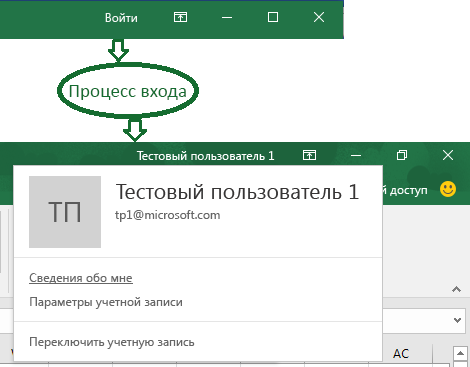

# <a name="enable-single-sign-on-for-office-add-ins-preview"></a>Включение единого входа для надстроек Office (тестовый режим)

Пользователи входят в Office (в Интернете, на мобильных устройствах и настольных компьютерах), используя личную учетную запись Майкрософт либо рабочую или учебную учетную запись (Office 365). Вы можете использовать единый вход для выполнения следующих задач (при этом пользователю не потребуется входить повторно):

* авторизация пользователя для входа в надстройку;
* предоставление надстройке доступа к [Microsoft Graph](https://developer.microsoft.com/graph/docs).



> [!NOTE]
> В настоящее время API единого входа поддерживается для Word, Excel, Outlook и PowerPoint в тестовом режиме. Дополнительные сведения о текущей поддержке API единого входа см. в статье [Наборы обязательных элементов API идентификации](https://dev.office.com/reference/add-ins/requirement-sets/identity-api-requirement-sets).
> Если вы работаете с надстройкой Outlook, обязательно включите современную проверку подлинности для клиента Office 365. Инструкции см. в [этой статье](https://social.technet.microsoft.com/wiki/contents/articles/32711.exchange-online-how-to-enable-your-tenant-for-modern-authentication.aspx).

Для пользователей это означает, что для запуска надстройки не нужно заново входить в систему. Для разработчиков это означает, что надстройка может выполнять проверку подлинности пользователя и получать авторизованный доступ к его данным через Microsoft Graph по уже указанным учетным данным.

## <a name="sso-add-in-architecture"></a>Архитектура надстройки с единым входом

Помимо страниц и кода JavaScript веб-приложения, в надстройке также должны размещаться (с тем же [полным доменном именем](https://msdn.microsoft.com/ru-ru/library/windows/desktop/ms682135.aspx#_dns_fully_qualified_domain_name_fqdn__gly)) один или несколько веб-API, которые будут получать маркер доступа и отправлять запросы к Microsoft Graph.

Манифест надстройки содержит разметку, которая указывает, как надстройка регистрируется в конечной точке Azure Active Directory (Azure AD) версии 2.0, а также задает необходимые надстройке разрешения для Microsoft Graph.

### <a name="how-it-works-at-runtime"></a>Принцип работы во время выполнения

На приведенной ниже схеме показано, как работает единый вход.
<!-- Minor fixes to the text in the diagram - change V2 to v2.0, and change "(e.g. Word, Excel, etc.)" to "(for example, Word, Excel)". -->


1. Код JavaScript надстройки вызывает новый API Office.js — `getAccessTokenAsync`. Он указывает ведущему приложению Office, что необходимо получить маркер доступа к надстройке (далее — **маркер надстройки**).
1. Если вход в Office не выполнен, в ведущем приложении открывается всплывающее окно, в котором пользователю предлагается войти.
1.  Если пользователь запускает надстройку в первый раз, ему предлагается дать согласие.
1. Ведущее приложение Office запрашивает **маркер надстройки** у конечной точки Azure AD версии 2.0 для текущего пользователя.
1. Azure AD отправляет маркер надстройки ведущему приложению Office.
1. Ведущее приложение Office отправляет **маркер** надстройке в составе объекта результата, возвращенного при вызове метода `getAccessTokenAsync`.
1. Код JavaScript надстройки отправляет HTTP-запрос к веб-API с тем же полным доменным именем, что и у надстройки. Этот запрос включает **маркер надстройки** в качестве подтверждения авторизации.  
1. Серверный код проверяет входящий **маркер надстройки**.
1. Серверный код использует поток "от имени" (определенный в [OAuth2 Token Exchange](https://tools.ietf.org/html/draft-ietf-oauth-token-exchange-02) и [сценарии аутентификации в Azure из управляющей программы или серверного приложения в веб-API](https://docs.microsoft.com/ru-ru/azure/active-directory/develop/active-directory-authentication-scenarios#daemon-or-server-application-to-web-api)), чтобы получить маркер доступа для Microsoft Graph (далее — **маркер MSG**) в обмен на маркер надстройки.
1. Azure AD возвращает надстройке **маркер MSG** (и маркер обновления, если надстройка запрашивает разрешение *offline_access*).
1. Серверный код кэширует **маркеры MSG**.
1. Серверный код отправляет запросы к Microsoft Graph и включает **маркер MSG**.
1. Microsoft Graph возвращает данные надстройке, а она может передать их своему пользовательскому интерфейсу.
1. Когда истекает срок действия **маркера MSG**, серверный код может использовать свой маркер обновления, чтобы получить новый маркер MSG.

## <a name="develop-an-sso-add-in"></a>Разработка надстройки с единым входом

В этом разделе описаны задачи, необходимые для создания надстройки Office с единым входом. Эти задачи описываются независимо от языка и платформы. Подробные пошаговые инструкции см. в следующих статьях:

* [Создание надстройки Office на платформе Node.js с использованием единого входа](create-sso-office-add-ins-nodejs.md)
* [Создание надстройки Office на платформе ASP.NET с использованием единого входа](create-sso-office-add-ins-aspnet.md)

### <a name="create-the-service-application"></a>Создание приложения-службы

Зарегистрируйте надстройку на портале регистрации для конечной точки Azure версии 2.0: https://apps.dev.microsoft.com. Этот процесс занимает 5–10 минут и включает следующие задачи:

* получение идентификатора и секрета клиента для надстройки;
* указание необходимых надстройке разрешений для Microsoft Graph;
* предоставление надстройке доверия ведущего приложения Office;
* предварительная авторизация ведущего приложения Office для надстройки с помощью заданного по умолчанию разрешения *access_as_user*.

### <a name="configure-the-add-in"></a>Конфигурация надстройки

Добавьте новую разметку в манифест надстройки:

* **WebApplicationInfo** — родительский элемент для указанных ниже элементов;
* **Id** — идентификатор клиента надстройки;
* **Resource** — URL-адрес надстройки;
* **Scopes** — родительский элемент одного или нескольких элементов **Scope**;
* **Scope** — указывает разрешение, необходимое надстройке для работы с Microsoft Graph. Например: `User.Read`, `Mail.Read` или `offline_access`. Дополнительные сведения см. в статье [Разрешения Microsoft Graph](https://developer.microsoft.com/en-us/graph/docs/concepts/permissions_reference).

Для всех ведущих приложений, кроме Outlook, добавьте разметку в конец раздела `<VersionOverrides ... xsi:type="VersionOverridesV1_0">`. Для Outlook добавьте разметку в конец раздела `<VersionOverrides ... xsi:type="VersionOverridesV1_1">`.

### <a name="add-client-side-code"></a>Добавление кода для клиента

Добавьте в надстройку код JavaScript для:

* вызова метода `Office.context.auth.getAccessTokenAsync(myTokenHandler)`;
* создания обработчика, который передает маркер надстройки ее серверному коду. Пример:

```js
function mytokenHandler(asyncResult) {
    // Passes asyncResult.value (which has the add-in access token)
    // to the add-in’s web API as an Authorization header.
}
```

### <a name="when-to-call-the-method"></a>Когда вызывать метод

Если надстройка не может работать без входа в Office и у Office нет соответствующего маркера доступа, метод `getAccessTokenAsync` необходимо вызывать *при запуске надстройки*.

Если надстройка может работать без доступа к Microsoft Graph и даже входа, метод `getAccessTokenAsync` вызывается, *когда требуется доступ к Microsoft Graph или по крайней мере вход*. Производительность не снижается при повторяющихся вызовах `getAccessTokenAsync`, так как Office кэширует маркер доступа и использует его, пока не истечет срок его действия, не вызывая конечную точку AAD 2.0 при каждом вызове `getAccessTokenAsync`. Поэтому вызовы `getAccessTokenAsync` можно добавлять во все функции и обработчики, которые инициируют действие, где нужен маркер.

### <a name="add-server-side-code"></a>Добавление серверного кода

Создайте один или несколько методов веб-API, которые получают данные Microsoft Graph. В зависимости от языка и платформы, могут быть доступны библиотеки, который упростят создание нужного кода. Серверный код должен:

* проверять маркер надстройки, полученный от созданного ранее обработчика маркеров;
* запускать поток "от имени" путем вызова конечной точки Azure AD версии 2.0, включающего маркер доступа к надстройке, некоторые метаданные пользователя и учетные данные надстройки (код и секрет);
* кэшировать возвращенный маркер MSG;
* получать данные из Microsoft Graph с помощью маркера MSG.
