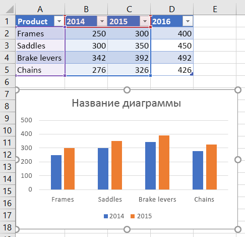
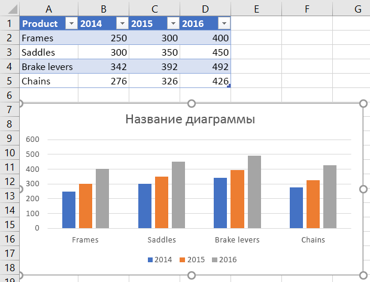
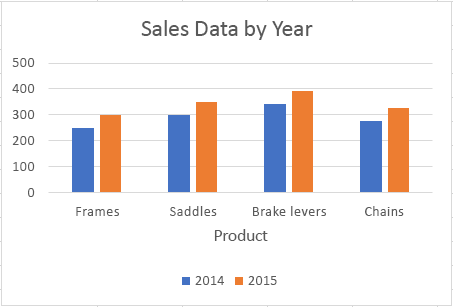
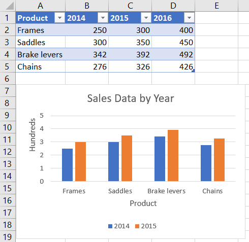
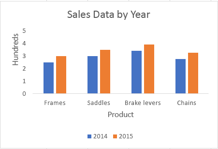
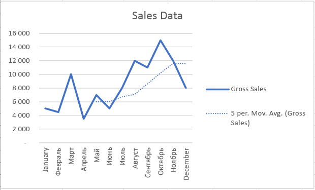

# <a name="work-with-charts-using-the-excel-javascript-api"></a><span data-ttu-id="ff2ac-102">?????? ? ??????????? ? ?????????????? API JavaScript ??? Excel</span><span class="sxs-lookup"><span data-stu-id="ff2ac-102">Work with Charts using the Excel JavaScript API</span></span>

<span data-ttu-id="ff2ac-103">? ???? ?????? ????????? ??????? ????, ? ??????? ????????, ??? ????????? ??????????? ?????? ??? ???????? ? ?????????????? API JavaScript ??? Excel.</span><span class="sxs-lookup"><span data-stu-id="ff2ac-103">This article provides code samples that show how to perform common tasks with charts using the Excel JavaScript API.</span></span> <span data-ttu-id="ff2ac-104">?????? ?????? ??????? ? ???????, ?????????????? ????????? **Chart** ? **ChartCollection**, ??. ? ??????? [?????? Chart (API JavaScript ??? Excel)](https://dev.office.com/reference/add-ins/excel/chart) ? [?????? ChartCollection (API JavaScript ??? Excel)](https://dev.office.com/reference/add-ins/excel/chartcollection).</span><span class="sxs-lookup"><span data-stu-id="ff2ac-104">For the complete list of properties and methods that the **Chart** and **ChartCollection** objects support, see [Chart Object (JavaScript API for Excel)](https://dev.office.com/reference/add-ins/excel/chart) and [Chart Collection Object (JavaScript API for Excel)](https://dev.office.com/reference/add-ins/excel/chartcollection).</span></span>

## <a name="create-a-chart"></a><span data-ttu-id="ff2ac-105">???????? ?????????</span><span class="sxs-lookup"><span data-stu-id="ff2ac-105">Create a chart</span></span>

<span data-ttu-id="ff2ac-106">? ??????? ???? ???? ????????, ??? ??????? ????????? ?? ????? **Sample** (??????).</span><span class="sxs-lookup"><span data-stu-id="ff2ac-106">The following code sample creates a chart in the worksheet named **Sample**.</span></span> <span data-ttu-id="ff2ac-107">????????? ???????????? ????? **??????**, ??????????? ?? ?????? ?????? ?? ????????? **A1:B13**.</span><span class="sxs-lookup"><span data-stu-id="ff2ac-107">The chart is a **Line** chart that is based upon data in the range **A1:B13**.</span></span>

```js
Excel.run(function (context) {
    var sheet = context.workbook.worksheets.getItem("Sample");
    var dataRange = sheet.getRange("A1:B13");
    var chart = sheet.charts.add("Line", dataRange, "auto");

    chart.title.text = "Sales Data";
    chart.legend.position = "right"
    chart.legend.format.fill.setSolidColor("white");
    chart.dataLabels.format.font.size = 15;
    chart.dataLabels.format.font.color = "black";

    return context.sync();
}).catch(errorHandlerFunction);
```

<span data-ttu-id="ff2ac-108">**????? ??????**</span><span class="sxs-lookup"><span data-stu-id="ff2ac-108">**New line chart**</span></span>


## <a name="add-a-data-series-to-a-chart"></a><span data-ttu-id="ff2ac-110">?????????? ???? ?????? ? ?????????</span><span class="sxs-lookup"><span data-stu-id="ff2ac-110">Add a data series to a chart</span></span>

<span data-ttu-id="ff2ac-111">? ??????? ???? ???? ????????, ??? ???????? ??? ?????? ? ?????? ????????? ?? ?????.</span><span class="sxs-lookup"><span data-stu-id="ff2ac-111">The following code sample adds a data series to the first chart in the worksheet.</span></span> <span data-ttu-id="ff2ac-112">????? ??? ?????? ????????????? ??????? **2016** ? ??????? ?? ?????? ?? ????????? **D2:D5**.</span><span class="sxs-lookup"><span data-stu-id="ff2ac-112">The new data series corresponds to the column named **2016** and is based upon data in the range **D2:D5**.</span></span>

> [!NOTE]
> <span data-ttu-id="ff2ac-113">? ???? ??????? ???????????? API, ??????? ? ?????? ?????? ???????? ?????? ? ???? ????????????? ??????????????? ?????? (????-??????).</span><span class="sxs-lookup"><span data-stu-id="ff2ac-113">This sample uses APIs that are currently available only in public preview (beta).</span></span> <span data-ttu-id="ff2ac-114">????? ????????? ???? ???????, ?? ?????? ???????????? ????-?????????? CDN Office.js: https://appsforoffice.microsoft.com/lib/beta/hosted/office.js.</span><span class="sxs-lookup"><span data-stu-id="ff2ac-114">To run this sample, you must use the beta library of the Office.js CDN: https://appsforoffice.microsoft.com/lib/beta/hosted/office.js.</span></span>

```js
Excel.run(function (context) {
    var sheet = context.workbook.worksheets.getItem("Sample");
    var chart = sheet.charts.getItemAt(0);
    var dataRange = sheet.getRange("D2:D5");

    var newSeries = chart.series.add("2016");
    newSeries.setValues(dataRange);

    return context.sync();
}).catch(errorHandlerFunction);
```

<span data-ttu-id="ff2ac-115">**????????? ????? ??????????? ???? ?????? 2016**</span><span class="sxs-lookup"><span data-stu-id="ff2ac-115">**Chart before the 2016 data series is added**</span></span>



<span data-ttu-id="ff2ac-117">**????????? ????? ?????????? ???? ?????? 2016**</span><span class="sxs-lookup"><span data-stu-id="ff2ac-117">**Chart after the 2016 data series is added**</span></span>



## <a name="set-chart-title"></a><span data-ttu-id="ff2ac-119">??????? ???????? ?????????</span><span class="sxs-lookup"><span data-stu-id="ff2ac-119">Set chart title</span></span>

<span data-ttu-id="ff2ac-120">? ??????? ???? ????????, ??? ?????? ???????? **Sales Data by Year** (?????? ?????? ?? ?????) ??? ?????? ????????? ?? ?????.</span><span class="sxs-lookup"><span data-stu-id="ff2ac-120">The following code sample sets the title of the first chart in the worksheet to **Sales Data by Year**.</span></span> 

```js
Excel.run(function (context) {
    var sheet = context.workbook.worksheets.getItem("Sample");

    var chart = sheet.charts.getItemAt(0);
    chart.title.text = "Sales Data by Year";

    return context.sync();
}).catch(errorHandlerFunction);
```

<span data-ttu-id="ff2ac-121">**????????? ????? ??????? ?????????**</span><span class="sxs-lookup"><span data-stu-id="ff2ac-121">**Chart after title is set**</span></span>


## <a name="set-properties-of-an-axis-in-a-chart"></a><span data-ttu-id="ff2ac-123">??????? ??????? ??? ?????????</span><span class="sxs-lookup"><span data-stu-id="ff2ac-123">Set properties of an axis in a chart</span></span>

<span data-ttu-id="ff2ac-124">?????????, ? ??????? ???????????? [????????? ??????? ?????????](https://en.wikipedia.org/wiki/Cartesian_coordinate_system), ???????? ???????????, ?????????? ? ???????? ?????????, ???????? ??? ????????? ? ??? ????????.</span><span class="sxs-lookup"><span data-stu-id="ff2ac-124">Charts that use the [Cartesian coordinate system](https://en.wikipedia.org/wiki/Cartesian_coordinate_system) such as column charts, bar charts, and scatter charts contain a category axis and a value axis.</span></span> <span data-ttu-id="ff2ac-125">? ???????? ???? ????????, ??? ?????? ???????? ? ?????????? ??????? ????????? ?? ??? ??? ?????????.</span><span class="sxs-lookup"><span data-stu-id="ff2ac-125">These examples show how to set the title and display unit of an axis in a chart.</span></span>

### <a name="set-axis-title"></a><span data-ttu-id="ff2ac-126">??????? ???????? ???</span><span class="sxs-lookup"><span data-stu-id="ff2ac-126">Set axis title</span></span>

<span data-ttu-id="ff2ac-127">? ??????? ???? ???? ????????, ??? ?????? ???????? **Product** (???????) ??? ??? ????????? ?????? ????????? ?? ?????.</span><span class="sxs-lookup"><span data-stu-id="ff2ac-127">The following code sample sets the title of the category axis for the first chart in the worksheet to **Product**.</span></span>

```js
Excel.run(function (context) {
    var sheet = context.workbook.worksheets.getItem("Sample");

    var chart = sheet.charts.getItemAt(0);
    chart.axes.categoryAxis.title.text = "Product";

    return context.sync();
}).catch(errorHandlerFunction);
```

<span data-ttu-id="ff2ac-128">**????????? ????? ??????? ???????? ??? ?????????**</span><span class="sxs-lookup"><span data-stu-id="ff2ac-128">**Chart after title of category axis is set**</span></span>



### <a name="set-axis-display-unit"></a><span data-ttu-id="ff2ac-130">??????? ???????????? ??????? ????????? ???</span><span class="sxs-lookup"><span data-stu-id="ff2ac-130">Set axis display unit</span></span>

<span data-ttu-id="ff2ac-131">? ??????? ???? ????????, ??? ?????? ???????????? ??????? ????????? **Hundreds** (?????) ??? ??? ???????? ?????? ????????? ?? ?????.</span><span class="sxs-lookup"><span data-stu-id="ff2ac-131">The following code sample sets the display unit of the value axis for the first chart in the worksheet to **Hundreds**.</span></span>

> [!NOTE]
> <span data-ttu-id="ff2ac-132">? ???? ??????? ???????????? API, ??????? ? ?????? ?????? ???????? ?????? ? ???? ????????????? ??????????????? ?????? (????-??????).</span><span class="sxs-lookup"><span data-stu-id="ff2ac-132">This sample uses APIs that are currently available only in public preview (beta).</span></span> <span data-ttu-id="ff2ac-133">????? ????????? ???? ???????, ?? ?????? ???????????? ????-?????????? CDN Office.js: https://appsforoffice.microsoft.com/lib/beta/hosted/office.js.</span><span class="sxs-lookup"><span data-stu-id="ff2ac-133">To run this sample, you must use the beta library of the Office.js CDN: https://appsforoffice.microsoft.com/lib/beta/hosted/office.js.</span></span>

```js
Excel.run(function (context) {
    var sheet = context.workbook.worksheets.getItem("Sample");

    var chart = sheet.charts.getItemAt(0);
    chart.axes.valueAxis.displayUnit = "Hundreds";

    return context.sync();
}).catch(errorHandlerFunction);
```

<span data-ttu-id="ff2ac-134">**????????? ????? ??????? ??????? ????????? ??? ????????**</span><span class="sxs-lookup"><span data-stu-id="ff2ac-134">**Chart after display unit of value axis is set**</span></span>



## <a name="set-visibility-of-gridlines-in-a-chart"></a><span data-ttu-id="ff2ac-136">????????? ????????? ????? ????? ?? ?????????</span><span class="sxs-lookup"><span data-stu-id="ff2ac-136">Set visibility of gridlines in a chart</span></span>

<span data-ttu-id="ff2ac-137">? ??????? ???? ????????, ??? ?????? ???????? ????? ????? ??? ??? ???????? ?????? ????????? ?? ?????.</span><span class="sxs-lookup"><span data-stu-id="ff2ac-137">The following code sample hides the major gridlines for the value axis of the first chart in the worksheet.</span></span> <span data-ttu-id="ff2ac-138">?? ?????? ?????????? ???????? ????? ????? ??? ??? ???????? ?????????, ????? ??? ???????? `chart.axes.valueAxis.majorGridlines.visible` ???????? **true**.</span><span class="sxs-lookup"><span data-stu-id="ff2ac-138">You can show the major gridlines for the value axis of the chart, by setting `chart.axes.valueAxis.majorGridlines.visible` to **true**.</span></span>

```js
Excel.run(function (context) {
    var sheet = context.workbook.worksheets.getItem("Sample");

    var chart = sheet.charts.getItemAt(0);
    chart.axes.valueAxis.majorGridlines.visible = false;

    return context.sync();
}).catch(errorHandlerFunction);
```

<span data-ttu-id="ff2ac-139">**????????? ?? ???????? ??????? ?????**</span><span class="sxs-lookup"><span data-stu-id="ff2ac-139">**Chart with gridlines hidden**</span></span>



## <a name="chart-trendlines"></a><span data-ttu-id="ff2ac-141">????? ??????? ?????????</span><span class="sxs-lookup"><span data-stu-id="ff2ac-141">Chart trendlines</span></span>

### <a name="add-a-trendline"></a><span data-ttu-id="ff2ac-142">?????????? ????? ??????</span><span class="sxs-lookup"><span data-stu-id="ff2ac-142">Add a trendline</span></span>

<span data-ttu-id="ff2ac-p108">? ??????? ???? ???? ????????, ??? ???????? ????? ?????? "?????????? ???????" ? ?????? ??? ?????? ????????? ?? ????? **Sample** (??????). ????? ?????? ?????????? "?????????? ???????" ?? 5 ????????.</span><span class="sxs-lookup"><span data-stu-id="ff2ac-p108">The following code sample adds a moving average trendline to the first series in the first chart in the worksheet named **Sample**. The trendline shows a moving average over 5 periods.</span></span>

> [!NOTE]
> <span data-ttu-id="ff2ac-145">? ???? ??????? ???????????? API, ??????? ? ?????? ?????? ???????? ?????? ? ???? ????????????? ??????????????? ?????? (????-??????).</span><span class="sxs-lookup"><span data-stu-id="ff2ac-145">This sample uses APIs that are currently available only in public preview (beta).</span></span> <span data-ttu-id="ff2ac-146">????? ????????? ???? ???????, ?? ?????? ???????????? ????-?????????? CDN Office.js: https://appsforoffice.microsoft.com/lib/beta/hosted/office.js.</span><span class="sxs-lookup"><span data-stu-id="ff2ac-146">To run this sample, you must use the beta library of the Office.js CDN: https://appsforoffice.microsoft.com/lib/beta/hosted/office.js.</span></span>

```js
Excel.run(function (context) {
    var sheet = context.workbook.worksheets.getItem("Sample");

    var chart = sheet.charts.getItemAt(0);
    var seriesCollection = chart.series;
    seriesCollection.getItemAt(0).trendlines.add("MovingAverage").movingAveragePeriod = 5;

    return context.sync();
}).catch(errorHandlerFunction);
```

<span data-ttu-id="ff2ac-147">**????????? ? ?????? ?????? "?????????? ???????"**</span><span class="sxs-lookup"><span data-stu-id="ff2ac-147">**Chart with moving average trendline**</span></span>



### <a name="update-a-trendline"></a><span data-ttu-id="ff2ac-149">????????? ????? ??????</span><span class="sxs-lookup"><span data-stu-id="ff2ac-149">Update a trendline</span></span>

<span data-ttu-id="ff2ac-150">? ??????? ???? ???? ????????, ??? ?????? ??? ????? ?????? ??? **Linear** (????????) ??? ??????? ???? ?????? ????????? ?? ????? **Sample** (??????).</span><span class="sxs-lookup"><span data-stu-id="ff2ac-150">The following code sample sets the trendline to type **Linear** for the first series in the first chart in the worksheet named **Sample**.</span></span>

> [!NOTE]
> <span data-ttu-id="ff2ac-151">? ???? ??????? ???????????? API, ??????? ? ?????? ?????? ???????? ?????? ? ???? ????????????? ??????????????? ?????? (????-??????).</span><span class="sxs-lookup"><span data-stu-id="ff2ac-151">This sample uses APIs that are currently available only in public preview (beta).</span></span> <span data-ttu-id="ff2ac-152">????? ????????? ???? ???????, ?? ?????? ???????????? ????-?????????? CDN Office.js: https://appsforoffice.microsoft.com/lib/beta/hosted/office.js.</span><span class="sxs-lookup"><span data-stu-id="ff2ac-152">To run this sample, you must use the beta library of the Office.js CDN: https://appsforoffice.microsoft.com/lib/beta/hosted/office.js.</span></span>

```js
Excel.run(function (context) {
    var sheet = context.workbook.worksheets.getItem("Sample");

    var chart = sheet.charts.getItemAt(0);
    var seriesCollection = chart.series;
    var series = seriesCollection.getItemAt(0);
    series.trendlines.getItem(0).type = "Linear";

    return context.sync();
}).catch(errorHandlerFunction);
```

<span data-ttu-id="ff2ac-153">**????????? ? ???????? ?????? ??????**</span><span class="sxs-lookup"><span data-stu-id="ff2ac-153">**Chart with linear trendline**</span></span>


## <a name="see-also"></a><span data-ttu-id="ff2ac-155">??. ?????</span><span class="sxs-lookup"><span data-stu-id="ff2ac-155">See also</span></span>

- [<span data-ttu-id="ff2ac-156">???????? ??????? API JavaScript ??? Excel</span><span class="sxs-lookup"><span data-stu-id="ff2ac-156">Excel JavaScript API core concepts</span></span>](excel-add-ins-core-concepts.md)
- [<span data-ttu-id="ff2ac-157">?????? Chart (API JavaScript ??? Excel)</span><span class="sxs-lookup"><span data-stu-id="ff2ac-157">Chart Object (JavaScript API for Excel)</span></span>](https://dev.office.com/reference/add-ins/excel/chart) 
- [<span data-ttu-id="ff2ac-158">?????? ChartCollection (API JavaScript ??? Excel)</span><span class="sxs-lookup"><span data-stu-id="ff2ac-158">Chart Collection Object (JavaScript API for Excel)</span></span>](https://dev.office.com/reference/add-ins/excel/chartcollection)