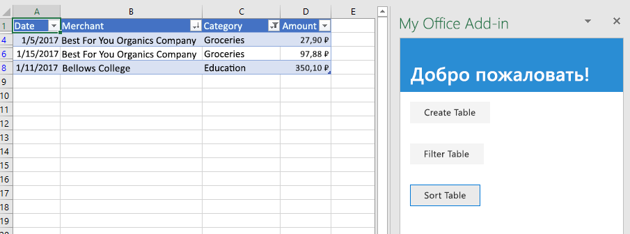

Из этого раздела руководства вы узнаете, как отфильтровать и отсортировать созданную ранее таблицу.

> [!NOTE]
> Это один из разделов руководства по надстройкам Excel. Если вы перешли на эту страницу со страницы результатов поисковой системы или по другой прямой ссылке, перейдите на вводную страницу [руководства по надстройкам Excel](../tutorials/excel-tutorial.yml), чтобы начать обучение с самого начала.

## <a name="filter-the-table"></a>Фильтрация таблицы

1. Откройте проект в редакторе кода. 
2. Откройте файл index.html.
3. Под элементом `div`, содержащим кнопку `create-table`, добавьте следующую разметку:

    ```html
    <div class="padding">            
        <button class="ms-Button" id="filter-table">Filter Table</button>            
    </div>
    ```

4. Откройте файл app.js.

5. Под строкой, назначающей обработчик нажатия кнопки `create-table`, добавьте следующий код:

    ```js
    $('#filter-table').click(filterTable);
    ```

6. Под функцией `createTable` добавьте следующую функцию:

    ```js
    function filterTable() {
        Excel.run(function (context) {
            
            // TODO1: Queue commands to filter out all expense categories except 
            //        Groceries and Education.

            return context.sync();
        })
        .catch(function (error) {
            console.log("Error: " + error);
            if (error instanceof OfficeExtension.Error) {
                console.log("Debug info: " + JSON.stringify(error.debugInfo));
            }
        });
    }
    ``` 

7. Замените `TODO1` приведенным ниже кодом. Обратите внимание:
   - Код получает ссылку на столбец, который нужно отфильтровать, передавая имя столбца методу `getItem`, а не передавая его индекс методу `getItemAt`, как это делает метод `createTable`. Так как пользователи могут перемещать столбцы, по заданному индексу может располагаться уже другой столбец. Следовательно, для получения ссылки безопаснее использовать имя столбца. Мы спокойно использовали метод `getItemAt` в предыдущем разделе, потому что мы использовали его в методе, который создает таблицу, и пользователь никак не мог переместить столбец.
   - Метод `applyValuesFilter` является одним из нескольких методов фильтрации объекта `Filter`.

    ```js
    const currentWorksheet = context.workbook.worksheets.getActiveWorksheet();
    const expensesTable = currentWorksheet.tables.getItem('ExpensesTable');
    const categoryFilter = expensesTable.columns.getItem('Category').filter;
    categoryFilter.applyValuesFilter(["Education", "Groceries"]);
    ``` 

## <a name="sort-the-table"></a>Сортировка таблицы

1. Откройте файл index.html.
2. Под элементом `div`, содержащим кнопку `filter-table`, добавьте следующую разметку:

    ```html
    <div class="padding">            
        <button class="ms-Button" id="sort-table">Sort Table</button>            
    </div>
    ```

3. Откройте файл app.js.

4. Под строкой, назначающей обработчик нажатия кнопки `filter-table`, добавьте следующий код:

    ```js
    $('#sort-table').click(sortTable);
    ```

5. Под функцией `filterTable` добавьте приведенную ниже функцию.

    ```js
    function sortTable() {
        Excel.run(function (context) {
            
            // TODO1: Queue commands to sort the table by Merchant name.

            return context.sync();
        })
        .catch(function (error) {
            console.log("Error: " + error);
            if (error instanceof OfficeExtension.Error) {
                console.log("Debug info: " + JSON.stringify(error.debugInfo));
            }
        });
    }
    ``` 

7. Замените `TODO1` приведенным ниже кодом. Обратите внимание:
   - Код создает массив объектов `SortField`, состоящий из одного элемента, так как надстройка сортирует таблицу только по столбцу Merchant.
   - Свойство `key` объекта `SortField` — это отсчитываемый от нуля индекс столбца, по которому необходимо сортировать таблицу.
   - Элемент `sort` объекта `Table` — это объект `TableSort`, а не метод. Объекты `SortField` передаются методу `apply` объекта `TableSort`.

    ```js
    const currentWorksheet = context.workbook.worksheets.getActiveWorksheet();
    const expensesTable = currentWorksheet.tables.getItem('ExpensesTable');
    const sortFields = [
        { 
            key: 1,            // Merchant column
            ascending: false,
        }
    ];

    expensesTable.sort.apply(sortFields);
    ``` 

## <a name="test-the-add-in"></a>Тестирование надстройки

1. Если окно Git Bash или системная командная строка с поддержкой Node.JS, открытые на предыдущем этапе руководства, все еще открыты, дважды нажмите клавиши CTRL+C, чтобы остановить работу веб-сервера. Если они закрыты, откройте окно Git Bash или системную командную строку с поддержкой Node.JS и перейдите к папке **Start** проекта.

     > [!NOTE]
     > Хотя сервер синхронизации браузера будет повторно загружать надстройку в области задач при каждом изменении любого файла (в том числе app.js), он не передает повторно код JavaScript, поэтому нужно будет снова выполнить команду сборки, чтобы изменения, внесенные в файл app.js, вступили в силу. Для этого следует завершить процесс сервера, чтобы можно было получить приглашение на ввод команды сборки. После сборки необходимо перезапустить сервер. Для этого выполните указанные ниже действия.

1. Выполните команду `npm run build`, чтобы преобразовать исходный код ES6 в JavaScript более ранней версии, которую поддерживает Internet Explorer (используется приложением Excel в фоновом режиме для запуска надстроек Excel).
2. Выполните команду `npm start`, чтобы запустить веб-сервер, работающий на localhost.
4. Повторно загрузите область задач. Для этого закройте ее, а затем выберите в меню **Главная** пункт **Показать область задач**.
5. Если по той или иной причине на открытом листе нет таблицы, нажмите в области задач кнопку **Create Table** (Создать таблицу). 
6. Нажмите кнопки **Filter Table** (Фильтровать таблицу) и **Sort Table** (Сортировать таблицу) в любом порядке.

    
