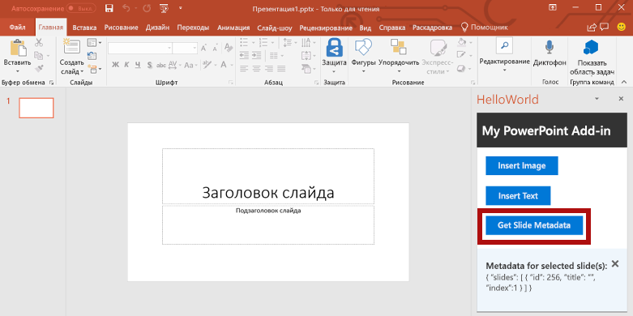

Из этого раздела руководства вы узнаете, как получить метаданные выбранного слайда.

> [!NOTE]
> Это один из разделов руководства по надстройкам PowerPoint. Если вы перешли на эту страницу со страницы результатов поисковой системы или по другой прямой ссылке, перейдите на вводную страницу [руководства по надстройкам PowerPoint](../tutorials/powerpoint-tutorial.yml), чтобы начать обучение с самого начала.

## <a name="get-slide-metadata"></a>Получение метаданных слайда

1. В файле **Home.html** замените `TODO4` приведенным ниже кодом. Этот код определяет кнопку **Get Slide Metadata** (Получить метаданные слайда), которая появится в области задач надстройки.

    ```html
    <br /><br />
    <button class="ms-Button ms-Button--primary" id="get-slide-metadata">
        <span class="ms-Button-icon"><i class="ms-Icon ms-Icon--plus"></i></span>
        <span class="ms-Button-label">Get Slide Metadata</span>
        <span class="ms-Button-description">Gets metadata for the selected slide(s).</span>
    </button>
    ```

2. В файле **Home.js** замените `TODO6` приведенным ниже кодом, чтобы назначить обработчик событий для кнопки **Get Slide Metadata** (Получить метаданные слайда).

    ```js
    $('#get-slide-metadata').click(getSlideMetadata);
    ```

3. В файле **Home.js** замените `TODO7` приведенным ниже кодом, чтобы определить функцию **getSlideMetadata**. Эта функция извлекает метаданные выбранных слайдов и записывает их во всплывающее диалоговое окно в области задач надстройки.

    ```js
    function getSlideMetadata() {
        Office.context.document.getSelectedDataAsync(Office.CoercionType.SlideRange,
            function (asyncResult) {
                if (asyncResult.status === Office.AsyncResultStatus.Failed) {
                    showNotification("Error", asyncResult.error.message);
                } else {
                    showNotification("Metadata for selected slide(s):", JSON.stringify(asyncResult.value), null, 2);
                }
            }
        );
    }
    ```

## <a name="test-the-add-in"></a>Тестирование надстройки

1. Протестируйте надстройку с помощью Visual Studio, нажав клавишу `F5` или кнопку **Запустить**, чтобы запустить PowerPoint с кнопкой надстройки **Show Taskpane** (Показать область задач) на ленте. Надстройка будет размещена на локальном сервере IIS.

    

2. В PowerPoint нажмите кнопку **Show Taskpane** (Показать область задач) на ленте, чтобы открыть надстройку области задач.

    

3. В области задач нажмите кнопку **Get Slide Metadata** (Получить метаданные слайда), чтобы получить метаданные выбранного слайда. Метаданные слайда записываются во всплывающее диалоговое окно в нижней части области задач. В этом случае массив `slides` в метаданных JSON содержит один объект, в котором указаны свойства `id`, `title` и `index` выбранного слайда. Если при извлечении метаданных будет выбрано несколько слайдов, массив `slides` в метаданных JSON будет содержать один объект для каждого выбранного слайда.

    

4. В Visual Studio остановите работу надстройки, нажав клавиши `Shift + F5` или кнопку **Остановить**. PowerPoint автоматически закроется.

    
