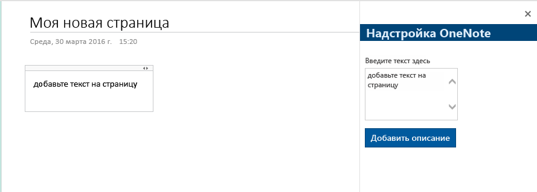

<a id="build-your-first-onenote-add-in" class="xliff"></a>

# Создание первой надстройки OneNote

В этой статье рассказано, как создать простую надстройку области задач, добавляющую текст на страницу в OneNote.

На приведенном ниже рисунке показана надстройка, которую вы создадите.

   

<a name="setup"></a>
<a id="step-1-set-up-your-dev-environment-and-create-an-add-in-project" class="xliff"></a>

## Шаг 1. Настройка среды разработки и создание проекта надстройки
Следуйте инструкциям по [созданию надстройки Office с помощью любого редактора](../get-started/create-an-office-add-in-using-any-editor.md), чтобы установить необходимые компоненты и запустить генератор Office Yeoman для создания нового проекта надстройки. В таблице ниже перечислены атрибуты проекта, которые нужно выбрать в генераторе Yeoman.

| Вариант | Значение |
|:------|:------|
| Новая вложенная папка | Используйте значение, указанное по умолчанию |
| Имя надстройки | OneNote Add-in (Надстройка OneNote) |
| Поддерживаемое приложение Office | Выберите OneNote |
| Создание надстройки | Yes, I want a new add-in (Да, создать новую надстройку) |
| Добавление [TypeScript](https://www.typescriptlang.org/) | No (Нет) |
| Выбор платформы | jQuery |

<a name="develop"></a>
<a id="step-2-modify-the-add-in" class="xliff"></a>

## Шаг 2. Изменение надстройки
Для изменения файлов надстройки можно использовать любой текстовый редактор или интегрированную среду разработки (IDE). Если вы еще не используете Visual Studio Code, вы можете [бесплатно скачать его](https://code.visualstudio.com/) для ОС Linux, Mac OSX и Windows.

1. Откройте **index.html** в каталоге проекта. 

2. Замените элемент `<main>` приведенным ниже кодом. При этом с помощью [компонентов Office UI Fabric](http://dev.office.com/fabric/components) будут добавлены текстовая область и кнопка.

```html
<main class="ms-welcome__main">
   <br />
   <p class="ms-font-l">Enter content below</p>
   <div class="ms-TextField ms-TextField--placeholder">
       <textarea id="textBox" rows="5"></textarea>
   </div>
   <button id="addOutline" class="ms-welcome__action ms-Button ms-Button--hero ms-u-slideUpIn20">
        <span class="ms-Button-label">Add Outline</span>
        <span class="ms-Button-icon"><i class="ms-Icon"></i></span>
        <span class="ms-Button-description">Adds the content above to the current page.</span>
    </button>
</main>
```

3. Откройте **app.js** (или app.ts, если используете TypeScript) в каталоге проекта. Измените функцию **Office.initialize** указанным ниже образом, чтобы добавить событие нажатия кнопки **Add outline** (Добавить структуру).

```js
// The initialize function is run each time the page is loaded.
Office.initialize = function (reason) {
   $(document).ready(function () {
       app.initialize();
       
       // Set up event handler for the UI.
       $('#addOutline').click(addOutlineToPage);
   });
};
```
 
4. Замените метод **run** указанным ниже методом **addOutlineToPage**. Этот метод получает содержимое из области текста и добавляет его на страницу.

```js
// Add the contents of the text area to the page.
function addOutlineToPage() {        
   OneNote.run(function (context) {
      var html = '<p>' + $('#textBox').val() + '</p>';
      
       // Get the current page.
       var page = context.application.getActivePage();
       
       // Queue a command to load the page with the title property.             
       page.load('title'); 
       
       // Add an outline with the specified HTML to the page.
       var outline = page.addOutline(40, 90, html);
       
       // Run the queued commands, and return a promise to indicate task completion.
       return context.sync()
           .then(function() {
               console.log('Added outline to page ' + page.title);
           })
           .catch(function(error) {
               app.showNotification("Error: " + error); 
               console.log("Error: " + error); 
               if (error instanceof OfficeExtension.Error) { 
                   console.log("Debug info: " + JSON.stringify(error.debugInfo)); 
               } 
           }); 
       });
}
```

<a name="test"></a>
<a id="step-3-test-the-add-in-on-onenote-online" class="xliff"></a>

## Шаг 3. Проверка надстройки в OneNote Online
1. Запустите HTTP-сервер.  

  А. Откройте командную строку **cmd** или терминал и перейдите к папке проекта надстройки. 
  
  Б. Выполните команду, как показано ниже.

  ```
  C:\your-local-path\onenote add-in\> npm start
  ```

2. Установите самозаверяющий сертификат в качестве доверенного сертификата. Вам потребуется только один раз сделать это на компьютере для всех проектов надстроек, созданных с помощью генератора Yeoman Office. Дополнительные сведения см. в статье [Добавление самозаверяющих сертификатов в качестве доверенных корневых сертификатов](https://github.com/OfficeDev/generator-office/blob/master/src/docs/ssl.md).

3. Перейдите на сайт [OneNote Online](https://www.onenote.com/notebooks) и откройте записную книжку.

4. Выберите элементы **Вставка > Надстройки Office**. Откроется диалоговое окно "Надстройки Office".

  Если вы выполнили вход с помощью пользовательской учетной записи, на вкладке **Мои надстройки** выберите элемент **Отправить надстройку**.
  
  Если вы выполнили вход с помощью рабочей или учебной учетной записи, на вкладке **Моя организация** выберите элемент **Отправить надстройку**. 
  
  На приведенном ниже изображении показана вкладка **Мои надстройки** для пользовательских записных книжек.

  

5. В диалоговом окне "Отправить надстройку" выберите **onenote-add-in-manifest.xml** в папке проекта и нажмите кнопку **Отправить**. Во время тестирования файл манифеста хранится в локальном хранилище браузера.

6. Надстройка откроется в iFrame рядом со страницей OneNote. Введите текст в текстовой области и нажмите кнопку **Добавить структуру**. Введенный текст будет добавлен на страницу. 

<a id="troubleshooting-and-tips" class="xliff"></a>

## Устранение неполадок и советы
Для отладки надстройки можно использовать имеющиеся в браузере средства разработчика. При использовании веб-сервера Gulp и отладке в Internet Explorer или Chrome вы можете сохранить внесенные изменения в локальном расположении, а затем просто обновить iFrame надстройки.

При проверке объекта OneNote для доступных свойств отображаются действительные значения. Для свойств, которые необходимо загрузить, отображается текст *не определено*. Разверните узел `_proto_`, чтобы отобразить свойства, которые определены для объекта, но еще не загружены.


Если надстройка использует какие-либо HTTP-ресурсы, то вам потребуется включить смешанное содержимое в браузере. Надстройки, которые применяются в рабочей среде, должны использовать только безопасные HTTPS-ресурсы.

Надстройки области задач можно открыть откуда угодно, но контентные надстройки вставляются только в содержимое стандартной страницы (не в заголовки, изображения, элементы iFrame и т. д.). 

<a id="additional-resources" class="xliff"></a>

## Дополнительные ресурсы

- [Обзор создания кода с помощью API JavaScript для OneNote](onenote-add-ins-programming-overview.md)
- [Справочник по API JavaScript для OneNote](../../reference/onenote/onenote-add-ins-javascript-reference.md)
- [Пример надстройки Rubric Grader](https://github.com/OfficeDev/OneNote-Add-in-Rubric-Grader)
- [Обзор платформы надстроек Office](https://dev.office.com/docs/add-ins/overview/office-add-ins)
