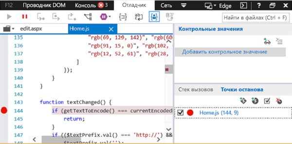

# ??????? ????????? ? ??????? ??????? ???????????? F12 ? Windows 10Debug add-ins using F12 developer tools on Windows 10

???????? ???????????? F12 ? Windows 10 ???????? ??????????, ??????????? ? ???????? ???-????????. ?? ????? ????? ???????????? ??? ?????????? ? ??????? ????????? Office, ???? ?? ???????????? ??????????????? ????? ??????????, ???????? Visual Studio, ??? ???? ?????????? ??????? ????????, ???????? ?????????? ??? ??????????????? ????? ??????????. ???????? ???????????? F12 ????? ????????? ????? ??????? ??????????.The F12 developer tools included in Windows 10 help you debug, test, and speed up your webpages. You can also use them to develop and debug Office Add-ins, if you are not using an IDE like Visual Studio, or if you need to investigate a problem while running your add-in outside the IDE. You can start the F12 developer tools after your add-in is running.

? ???? ?????? ????????, ??? ???????????? ???????? ?? ??????? ???????????? F12 ? Windows 10 ??? ???????????? ?????????? Office. ?? ?????? ??????????? ?????????? ?? AppSource ??? ?????? ??????????. ???????? F12 ???????????? ? ????????? ???? ? ?? ?????????? Visual Studio.This article shows how you how to use the Debugger tool from the F12 developer tools in Windows 10 to test your Office Add-in. You can test add-ins from AppSource or add-ins that you have added from other locations. The F12 tools display in a separate window and do not use Visual Studio.

> [!NOTE]
> ???????? ?????? ? ?????? ??????? ???????????? F12 ? Internet Explorer ? Windows 10, ?? ?? ??????? ? ?????????? ?????? Windows.The Debugger is part of the F12 developer tools in Windows 10 and Internet Explorer. Earlier versions of Windows do not include the Debugger. 

## ??????????? ??????????Prerequisites

??? ??????????? ????????? ??????????? ???????????:You need the following software:

- ???????? ???????????? F12, ??????? ?????? ? ?????? Windows 10;The F12 developer tools, which are included in Windows 10. 
    
- ?????????? ?????????? Office, ? ??????? ??????????? ??????????;The Office client application that hosts your add-in. 
    
- ??????????.Your add-in. 

## ????????????? ?????????Using the Debugger

? ???? ??????? ???????????? Word ? ?????????? ?????????? ?? AppSource.This example uses Word and a free add-in from AppSource.

1. ???????? Word ? ???????? ?????? ????????.Open Word and choose a blank document. 
    
2. ?? ??????? **???????**, ? ?????? "??????????", ???????? **???????**, ????? ???????? ?????????? QR4Office. (?? ?????? ????????? ????? ?????????? ?? ???????? ??? ???????? ?????????.)On the **Insert** tab, in the Add-ins group, choose **Store** and select the QR4Office add-in. (You can load any add-in from the Store or your add-in catalog.)
    
3. ????????? ???????? ???????????? F12, ??????? ????????????? ????? ?????? Office.Launch the F12 development tools that corresponds to your version of Office:
    
   - ???? ? ????? ??? 32-????????? ?????? Office ? C:\Windows\System32\F12\F12Chooser.exe.For the 32-bit version of Office, use C:\Windows\System32\F12\F12Chooser.exe
    
   - ???? ? ????? ??? 64-????????? ?????? Office ? C:\Windows\SysWOW64\F12\F12Chooser.exe.For the 64-bit version of Office, use C:\Windows\SysWOW64\F12\F12Chooser.exe
    
   ????? ?? ????????? F12Chooser, ? ????????? ???? "??????? ???? ??? ???????" ??????????? ??????????, ???????, ????????, ????? ????????. ???????? ??????????? ??????????. ???? ?? ???????? ??????????? ??????????, ???????? ???-????, ?? ??????? ??? ??????????. ??? ????? ???? URL-????? localhost.When you launch F12Chooser, a separate window named "Choose target to debug" displays the possible applications to debug. Select the application that you are interested in. If you are writing your own add-in, select the website where you have the add-in deployed, which might be a localhost URL. 
    
   ????????, ???????? **home.html**.For example, select **home.html**. 
    
   

4. ? ???? F12 ???????? ????, ??????? ????????? ????????.In the F12 window, select the file you want to debug.
    
   ????? ??????? ????, ??????? ?????? ????? ??? ???????? **?????????** (?????). ? ?????????????? ?????? ???????? ????????? ?????. ???????? ???? home.js.To select the file, choose the folder icon above the  **script** (left) pane. The dropdown list shows the available files. Select home.js.
    
5. ??????? ????? ????????.Set the breakpoint.
    
   ????? ?????? ????? ???????? ? home.js, ???????? ?????? 144 ? ??????? _textChanged_. ????? ?? ?????? ???????? ??????? ?????, ? ??????????????? ?????? ??????????? ? **??????? ????? ??????? ? ?????** (?????? ?????). ?????? ??????? ??????? ????? ???????? ??. ? ?????? [???????? ?????????? ???? JavaScript ? ??????? ?????????](https://msdn.microsoft.com/library/dn255007%28v=vs.85%29.aspx).To set the breakpoint in home.js, choose line 144, which is in the  _textChanged_ function. You will see a red dot to the left of the line and a corresponding line in the **Callstack and Breakpoints** (bottom right) pane. For other ways to set a breakpoint, see [Inspect running JavaScript with the Debugger](https://msdn.microsoft.com/library/dn255007%28v=vs.85%29.aspx). 
    
   

6. ????????? ??????????, ????? ???????????? ????? ????????.Run your add-in to trigger the breakpoint.
    
   ???????? ????????? ???? URL-?????? ? ??????? ????? ??????? QR4Office, ????? ???????? ?????. ? ??????? **????? ??????? ? ????? ????????** ????????? ????? ????????, ??? ????? ???????? ???????????? ? ?????????? ????????? ????????. ????? ??????? ??????????, ????? ????????????? ???????? ???????? ???????? F12.Choose the URL textbox in the upper part of the QR4Office pane to change the text. In the Debugger, in the **Callstack and Breakpoints** pane, you'll see that the breakpoint has triggered and shows various information. You might need to refresh the F12 tool to see the results.
    
   

## ??. ?????See also

- [???????? ?????????? ???? JavaScript ? ??????? ?????????Inspect running JavaScript with the Debugger](https://msdn.microsoft.com/library/dn255007%28v=vs.85%29.aspx)
- [????????????? ??????? ???????????? F12Using the F12 developer tools](https://msdn.microsoft.com/en-us/library/bg182326%28v=vs.85%29.aspx)
    
